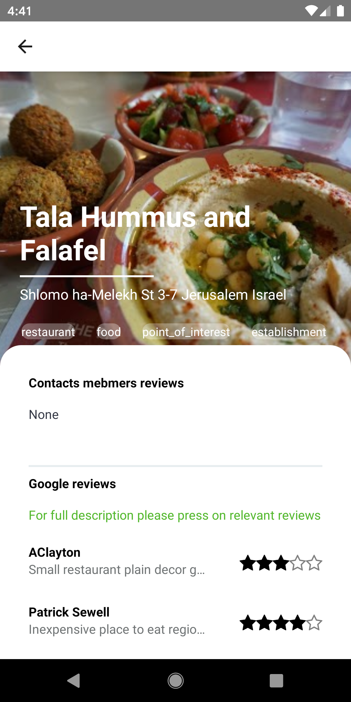
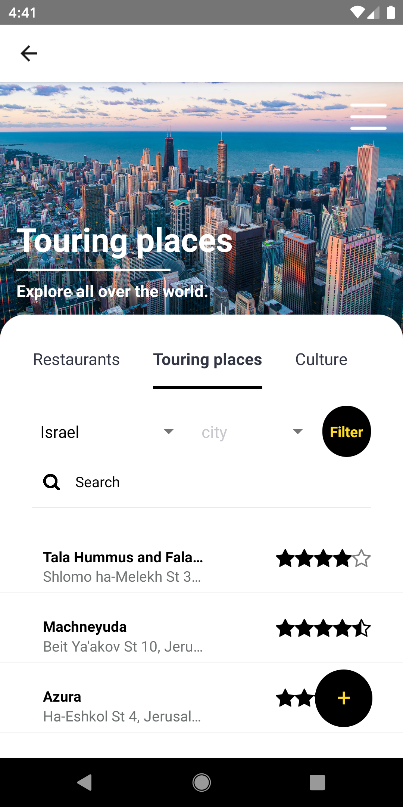

# SmartSearch
Smart search by weighted advices

There are a large selection of apps on the market that compare trips, restaurants, hotels, attractions, etc. But the problem with these apps is the reliability of the recommendations, so the system I built can rely more heavily on the recommendations.

The project is developing an app to show credible recommendations for places of entertainment / culture / restaurants.

The purpose of the project is to provide the user with an effective and reliable tool for finding recommendations for a variety of entertainment / culture / restaurants,

The system presents the weighted recommendations of the user's proximity that the user defined at the time of registration and in addition Google's recommendations and thus provides.

The rest of the system users favor users so that if they make a recommendation we will receive push notification to the phone.

<h2>part of the screens:</h2>

